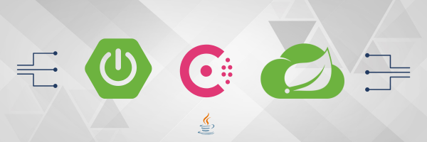
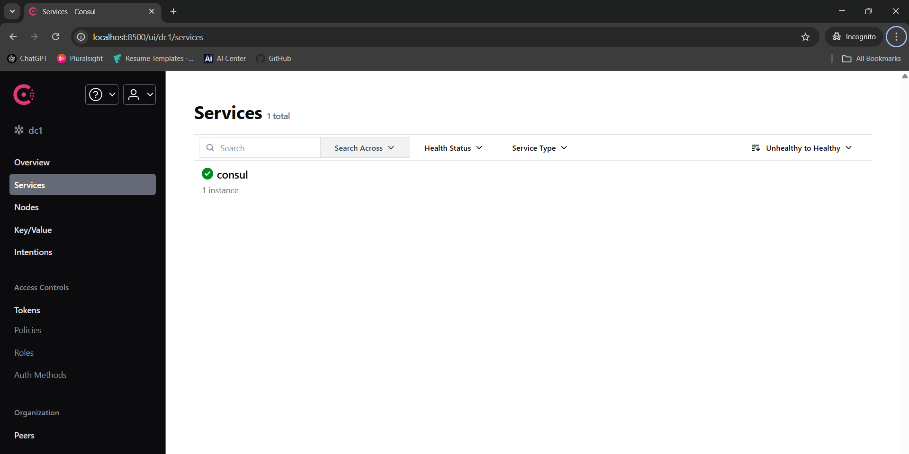
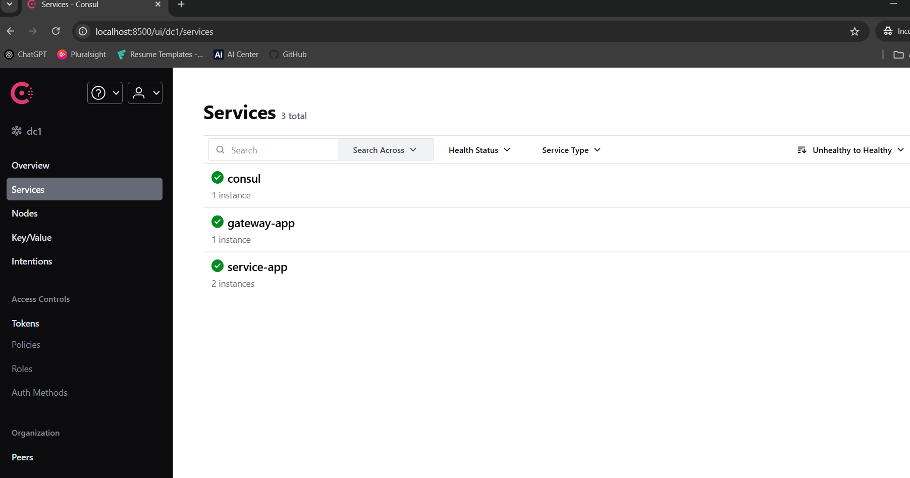
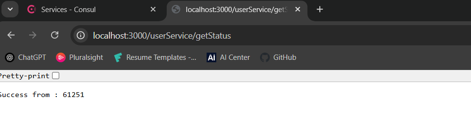
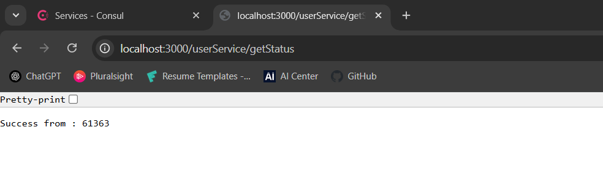

<p align="center">
  <br/><br/>
  
</p>


<h1 align="center">Spring Cloud Gateway with Service Discovery Using HashiCorp Consul</h1>

<p align="center">
  <br/><br/>
</p>


## Introduction 
This article will explain about some basics of HashiCorp Consul service and its configurations. It is a service networking solution that provides service registry and discovery capabilities, which integrate seamlessly with Spring Boot. You may have heard of Netflix Eureka, here Consul works similarly but offers many additional features. Notably, it supports the modern reactive programming paradigm. I will walk you through with the help of some applications.


## Used Libraries
* Spring Boot
* Spring Cloud Gateway
* Spring Cloud Consul
* Spring Boot Actuator

## Working
The architecture includes three main components.
* Consul
* Service application
* Gateway


## 1) Consul
We have to download and install consul service in system form Hashicorp Consul official website.
<br>[Download link ](https://developer.hashicorp.com/consul/install)
<br>
For the development purpose, we have to start it using a command in Powershell (In windows )

```powershell
consul agent -dev
``` 

### Consul dashboard
This is the place where we can see all the applications registered with Consul.The default port for accessing the Consul dashboard is 8500. Once it starts successfully, you will see something like below. Next step is to register the Gateway and Service applications to consul. Once those are added, it will appear in this same dashboard. When multiple instants of the same service are running, Consul continuously monitors their health using "Actuator". If any of them report an unhealthy status, Consul will automatically deregister it from the registry. 
<p align="center">
  
</p>


## 2) Service application
It is a simple service application for exposing the APIs. We added `@EnableDiscoveryClient` annotation in main class to register the service in consul for service discovery. If you run the application under multiple ports then you can see multiple instances in consul dashboard.Used Actuator to expose the health status.
### Main Class
```Java
@SpringBootApplication
@EnableDiscoveryClient
public class ServiceApp {

	public static void main(String[] args) {
		SpringApplication.run(ServiceApp.class, args);
	}

}
```
### Maven Configuration
```xml
    <properties>
        <java.version>21</java.version>
        <spring.cloud.version>2023.0.4</spring.cloud.version>
    </properties>

    <dependencies>

        <dependency>
            <groupId>org.springframework.boot</groupId>
            <artifactId>spring-boot-starter</artifactId>
        </dependency>

        <dependency>
            <groupId>org.springframework.boot</groupId>
            <artifactId>spring-boot-starter-webflux</artifactId>
        </dependency>

        <dependency>
            <groupId>org.springframework.cloud</groupId>
            <artifactId>spring-cloud-starter-consul-all</artifactId>
        </dependency>

        <dependency>
            <groupId>org.springframework.boot</groupId>
            <artifactId>spring-boot-starter-actuator</artifactId>
        </dependency>
    </dependencies>
```
### Application Property File
```properties
    # Assigning a unique name for the service
    spring.application.name=service-app

    # Application will use random ports
    server.port=0

    spring.webflux.base-path=/userService
    logback.log.file.path=./logs/service


    # ~~~ Consul Configuration ~~~

    # It assigns a unique ID to each instance of the service when running multiple instances,
    # allowing them to be registered individually in Consul for service discovery.
    spring.cloud.consul.discovery.instance-id=${spring.application.name}-${server.port}-${random.int[1,99]}

    # To access centralized configuration data from Consul
    spring.cloud.consul.config.enabled=false

    # To register the service in Consul using its IP address instead of the hostname.
    spring.cloud.consul.discovery.prefer-ip-address=true

    # The service will register itself in Consul under this name, which the gateway will use for service discovery while routing requests.
    spring.cloud.consul.discovery.service-name=${spring.application.name}

    # Ip to communicate with consul server
    spring.cloud.consul.host=localhost

    # Consul runs on port 8500 by default, unless it is explicitly overridden in the configuration. 
    spring.cloud.consul.port=8500

    # Remapping the Actuator URL in Consul since a base path has been added.
    spring.cloud.consul.discovery.health-check-path=${spring.webflux.base-path}/actuator/health

    # Time interval to check the health of service.
    spring.cloud.consul.discovery.health-check-interval=5s

    # Time need to wait for the health check response before considering it as timed out
    spring.cloud.consul.discovery.health-check-timeout=5s

    # The maximum amount of time a service can remain in an unhealthy state before Consul marks it as critical and removes it from the service catalog.
    #spring.cloud.consul.discovery.health-check-critical-timeout=1m
```

### Sample API
```Java

    @GetMapping(value = "getStatus", produces = MediaType.APPLICATION_JSON_VALUE)
    public Mono<ResponseEntity<Object>> healthCheck() {
        logger.info("<--- Service to get status request : received --->");
        logger.info("<--- Service to get status response : given --->");
        return Mono.just(ResponseEntity.ok("Success from : " + portListener.getPort()));
    }

```

## 3) Gateway
It is developed with the help of Spring cloud gateway. And it consists of the same libraries as the Service application. Consul is used for registering and service discovery of the application. Used Actuator to expose the health status.

### Main Class
```Java
@SpringBootApplication
@EnableDiscoveryClient
public class GatewayApp {

    public static void main(String[] args) {
        SpringApplication.run(GatewayApp.class, args);
    }
}

```
### Maven Configuration
```xml
    <properties>
        <java.version>21</java.version>
        <spring.cloud.version>2023.0.4</spring.cloud.version>
    </properties>

    <dependencies>

        <dependency>
            <groupId>org.springframework.boot</groupId>
            <artifactId>spring-boot-starter</artifactId>
        </dependency>

        <dependency>
            <groupId>org.springframework.boot</groupId>
            <artifactId>spring-boot-starter-webflux</artifactId>
        </dependency>

        <dependency>
            <groupId>org.springframework.cloud</groupId>
            <artifactId>spring-cloud-starter-consul-all</artifactId>
        </dependency>

        <dependency>
            <groupId>org.springframework.boot</groupId>
            <artifactId>spring-boot-starter-actuator</artifactId>
        </dependency>

        <dependency>
            <groupId>org.springframework.cloud</groupId>
            <artifactId>spring-cloud-starter-gateway</artifactId>
        </dependency>
    </dependencies>

```
### Application Property File
```properties
    # Assigning a unique name for the service
    spring.application.name=gateway-app
    server.port=3000

    logback.log.file.path=./logs/gateway


    # ~~~ Consul Configuration ~~~

    # It is used in Spring Cloud Gateway to handle automatic route discovery from a service registry
    # When we are configuring as false, we have to explicitly configure routing of each API requests.
    spring.cloud.gateway.discovery.locator.enabled=false

    spring.cloud.consul.discovery.instance-id=${spring.application.name}-${server.port}-${random.int[1,99]}
    spring.cloud.consul.config.enabled=false
    spring.cloud.consul.discovery.prefer-ip-address=true
    spring.cloud.consul.discovery.service-name=${spring.application.name}
    spring.cloud.consul.host=localhost
    spring.cloud.consul.port=8500

```
Since we have set `spring.cloud.gateway.discovery.locator.enabled` to `false`, we need to explicitly configure the routing for each API request as shown below. For the routing destination URL, instead of specifying the actual URL of the service application, we map it to the load-balanced (lb) URL provided by Consul using the service name
* In normal gateway 
`spring.cloud.gateway.routes[0].uri=http://192.168.1.10:5000`
* In service discovery enabled gateway
`spring.cloud.gateway.routes[0].uri=lb://service-app`

```properties

    #~~~ Example for a url routing ~~~

 
    spring.cloud.gateway.routes[0].id=0

    # Instead of configuring the actual url of service application, we are mapping in to the lb url of "consul" with service name. 
    spring.cloud.gateway.routes[0].uri=lb://service-app

    # Rest of the configuration will keep as same as spring cloud gateway configuration

    spring.cloud.gateway.routes[0].predicates[0]=Path=/userService/**
    spring.cloud.gateway.routes[0].filters[0]=RewritePath=/userService/(?<segment>.*), /userService/${segment}
    spring.cloud.gateway.routes[0].filters[1]=PreserveHostHeader

```

## Final Consul Dashboard
<p align="center">
  
</p>

Here we can see 1 instance of gateway-app and 2 instances of service-app. Because, I am running 2 instances of service app under different ports.

## Testing

Let's test it by calling a sample API through the gateway to verify that it's working.

<p align="center">
  
<br><br>
 
</p>
Here we can see that each time API returns response from different instance.
<br>
Thanks for reading !! 💖.


